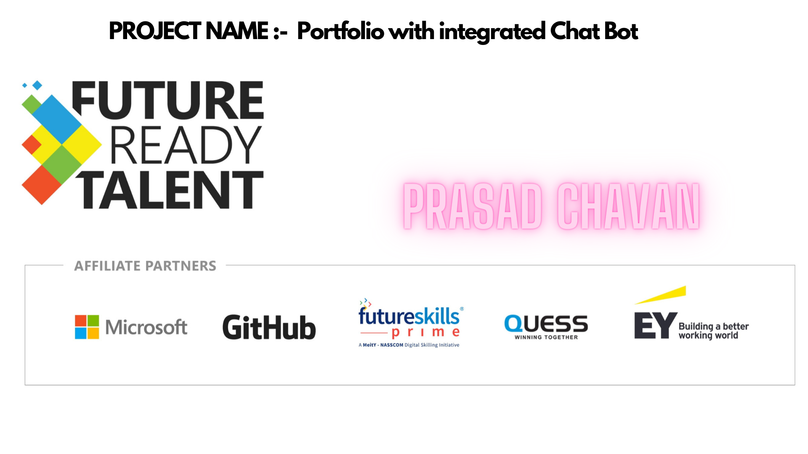
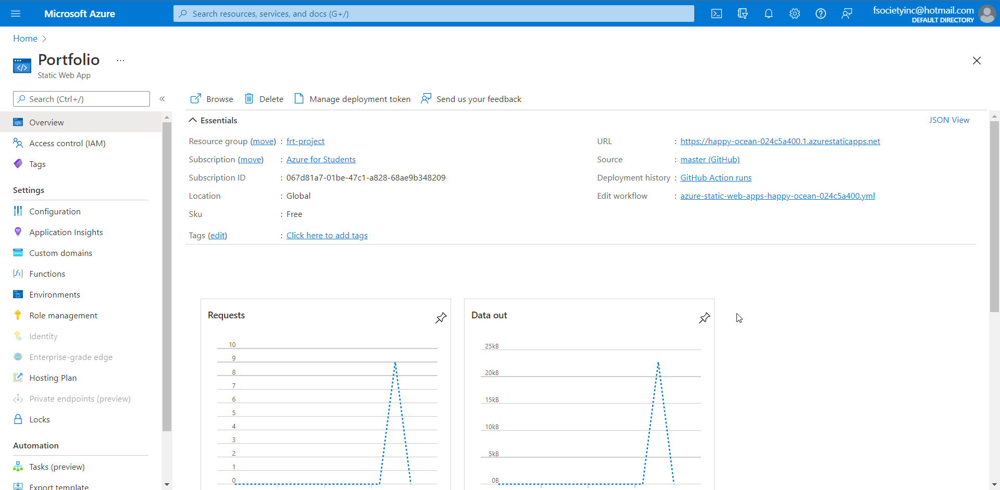
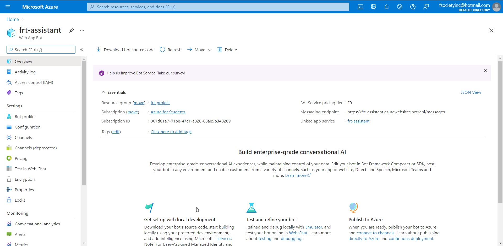
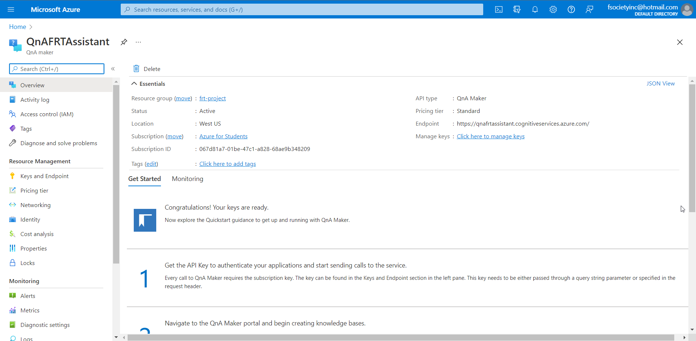
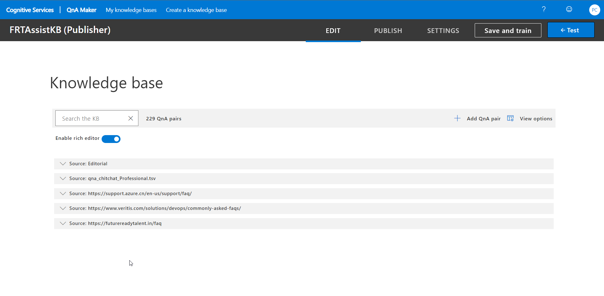
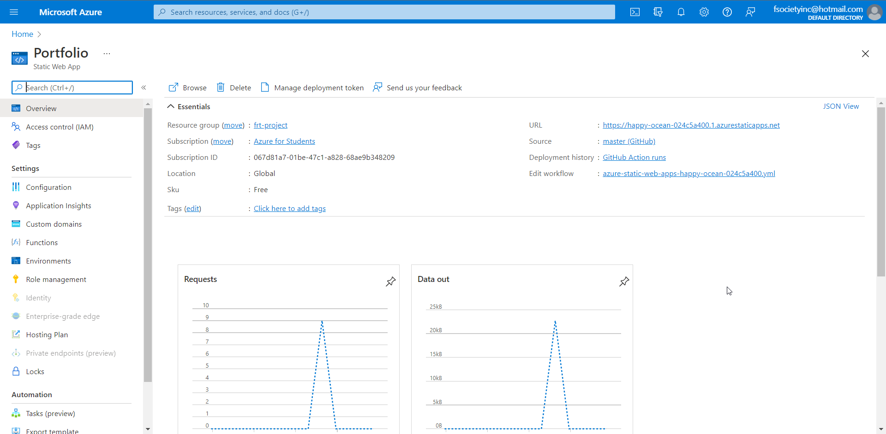

# Project Title

- Project submission for FutureReadyTalent 2021 - Portfolio with integrated Chat Bot

## Features - Bot

- The chat bot/assistant integration on the website can answer your queries regarding myself, Future Ready Talent internship FAQ and some other related to Azure and DevOps.

## Demo Link

<https://happy-ocean-024c5a400.1.azurestaticapps.net/>

## Problem Statement/Opportunity

- In this project, I will face difficulty creating my assistant bot service. This bot will help the visitor be automatically guided easily by answering the queries without any problem. It will take more effort and time to complete the project from scratch. However, we can use cloud computing means like Azure services. They have inbuilt products as SAAS to facilitate such business requirements. So we can quickly complete our project and get it up and running.
- There are many opportunities to explore, and I will learn about bot services, hosting services, azure environment, integration and deployment

## Project Description

- In this project, I will solve the problem of a query regarding my website, there will be an assistant, and this assistant will be available out there to guide the visitor.
- I will get free hosting services for a while with a free domain name from the Azure static web app service.
- In this project, I will use HTML, CSS, JavaScript etc., with a clean UI and an integration of a chatbot created using the QnA maker framework available as a service from Azure.
- The chatbot at the bottom right corner with an anchor point, if one clicks on the bot symbol, the box will appear, and it will disappear if I click on it.

## Project Images

- Home Page

## Azure Resources

Click to expand!

  
- Azure resource group

- Azure Web App Bot

- Azure QnA Maker

- Azure Static Web App

- Visual studio code

